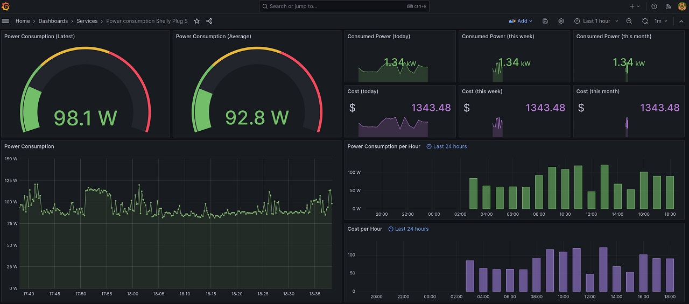

# Overview

Deploy Shelly Plug S dashboard in Docker with minimal efforts.

Monitoring consists of 4 main components:
* Shlly Plug S configured with login and password;
* Monitoring container collects data from Shelly Plug S for Prometheus (https://github.com/geerlingguy/shelly-plug-prometheus);
* Prometheus container aggregates data from the monitoring container;
* Grafana displays data from the prometheus container.

# Usage

* Clone repo: `git clone https://github.com/Stuw/shelly-plug-monitor.git --recursive`
* Change dir `cd shelly-plug-monitor`
* Copy `shelly-plug-config.env.sample` to `shelly-plug-config.env` and modify it to fit you shelly plug configuration
* OPTIONAL: edit `price.json` and run `./scripts/apply_price.py` to update per-hour price
IMPORTANT: use UTC time for price points
* Run `docker compose up`
* Go to Grafana at `http://<your_server_ip>:3000` and login with username `admin`and password `admin`
* Change Grafana admin password
* Find shelly plug dashboard (hint: Dashboards -> Services)
* Enjoy
